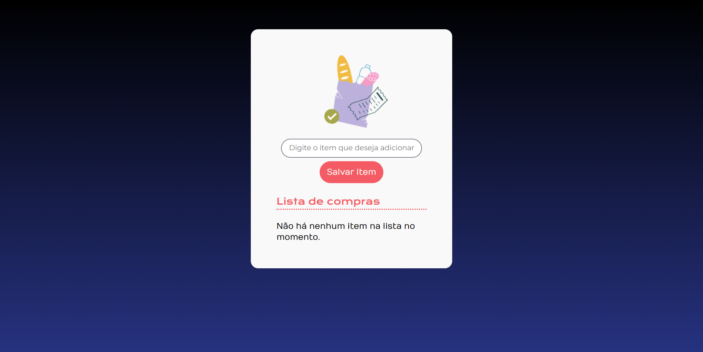

# 🛒 Lista de Compras

Aplicação web de lista de compras para o curso de construção de páginas dinâmicas com JavaScript.

## 🚀 Funcionalidades
✅ Adicionar novos itens à lista

✅ Marcar itens como comprados

✅ Remover itens da lista

✅ Interface amigável e responsiva

## 🛠️ Técnicas e tecnologias utilizadas

As técnicas e tecnologias utilizadas pra isso são:

- `HTML`: criação dos elementos da tela;
- `CSS`: estilização da aplicação;
- `JavaScript`: construção de elementos dinâmicos através da manipulação do DOM.

## 📁 Acesso ao projeto

Você pode [acessar o código fonte do projeto inicial](https://github.com/alura-cursos/3801-javascript-para-web/tree/projeto-base) ou [baixá-lo](https://github.com/alura-cursos/3801-javascript-para-web/archive/refs/heads/projeto-base.zip).

## 🛠🚀 Abrir e rodar o projeto

Após baixar o projeto, você pode abrir com o Visual Studio Code. Para isso, no menu superior, clique em:

- **File** > **Open Folder** (ou alguma opção similar)
- Procure o local onde o projeto está e o selecione (Caso o projeto seja baixado via zip, é necessário extraí-lo antes de procurá-lo)
- Por fim clique em OK

Ao finalizar esses passos, você pode executar a aplicação com a extensão Live Server 🏆 

